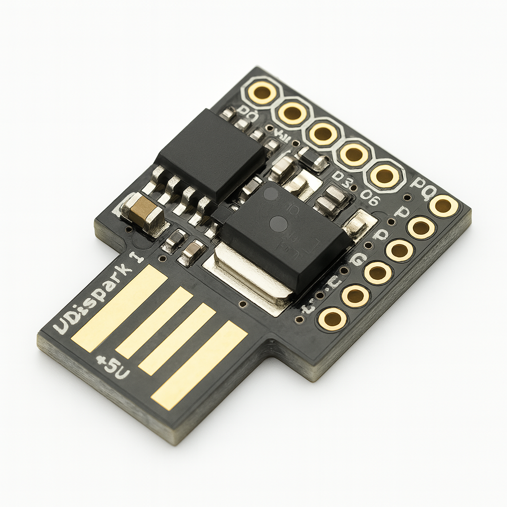
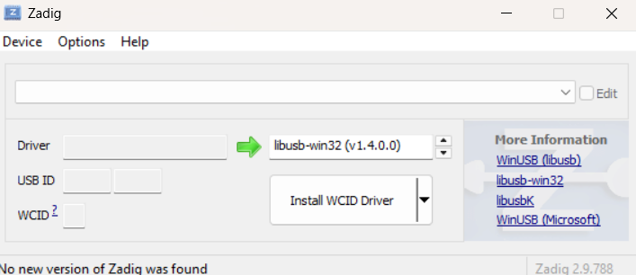
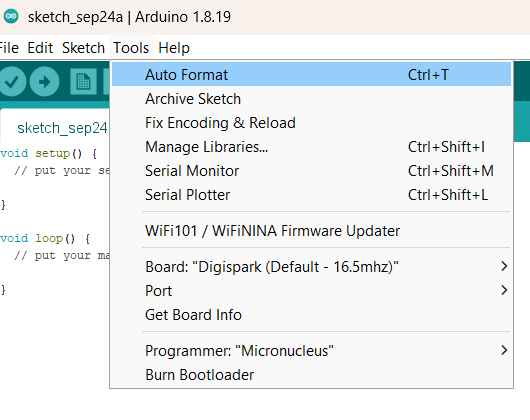

# digispark_workshop
Learn to automate keystrokes, inject scripts, and build USB-based payloads with Digispark.

## What is Digispark?

Digispark is a tiny, USB-powered microcontroller based on the ATtiny85 chip. It can emulate a keyboard or mouse (HID device), making it ideal for automating tasks on a computer—especially when plugged in directly via USB.

The Digispark may be tiny, but in the world of pentesting, it’s a surprisingly powerful ally—especially for physical access attacks and automated payload delivery.

- HID Attacks (Human Interface Device)
- Payload Injection
- Social Engineering Tools
- Automation for Recon & Exploits

## ETHICAL reminder

These tools are powerful, but they must be used responsibly and legally. In pentesting, Digispark shines when:

- You have authorized access
- You’re testing physical security
- You’re simulating real-world attack vectors
 

 
Besides pentesting the Digispark is a good way to automate tasks and to get familiar with hotkeys and the terminal.

## Getting started

We first need to get our workspace ready. We need the following:

- Digispark microcontroller ATtiny85 (widely available from different manufacturers)
- Install [Arduino IDE Legacy IDE (1.8.19)](https://www.arduino.cc/en/software/)
- Install [Zadig tool](https://zadig.akeo.ie/)

### Set up Arduino IDE

Step 1 Install Arduino IDE: When using Windows 11 it works better to install Arduino IDE version 1.8.19 

Step 2 Install Digiboard: Open the Arduino IDE and go to TOOLS and open the Board manager and search for 'Digistump AVR Boards' and choose version 1.6.7 and click Install.

Step 3 Finish IDE setup: Now back to TOOLS and set Board to Digispark(Default- 16.5mhz) and set the Programmer to Micronucleas.

### Setup driver with Zadig

Step 1 Open de Zadig tool

Step 2 Plug the Digispark in to the USB-port of your machine

Step 3 In Zadig go to OPTIONS and select LIST ALL DEVICES then from the dropdown select UNKNOWN DEVICE

Step 4 Now select the driver libusb-win32 or libusbk

Step 5 Click INSTALL THE DRIVER

